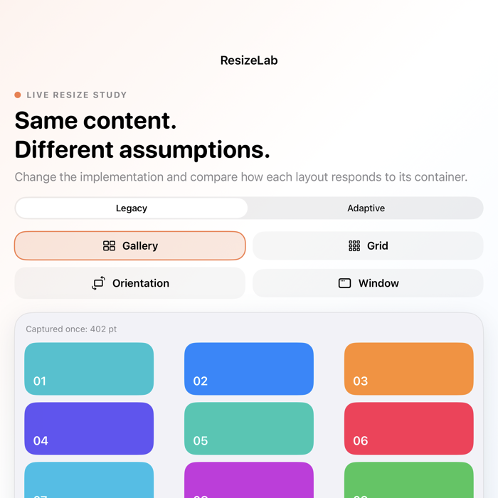
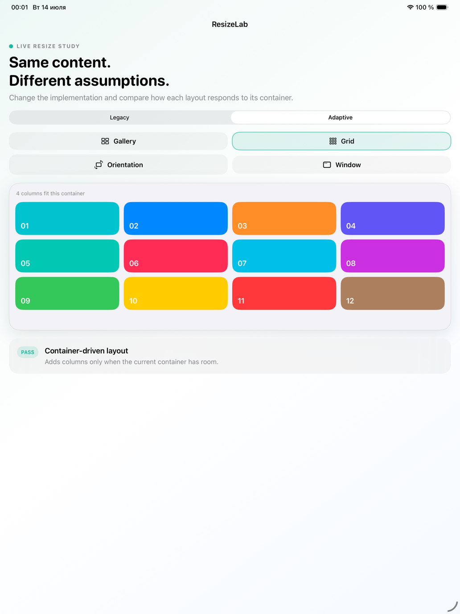
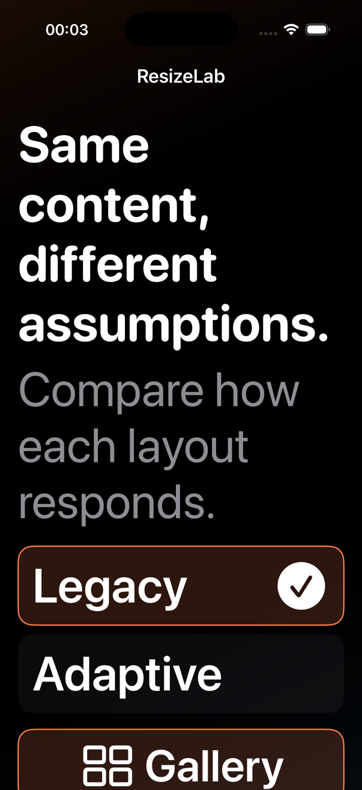

# ResizeLab simulator QA

ResizeLab was built and tested only with iOS Simulator destinations. No physical
device was selected or used.

## Environment

- macOS 26.5.2
- Xcode 26.5 (17F42)
- Apple Swift 6.3.2
- iPhone 17 Pro Simulator, iOS 26.5
- iPad Pro 13-inch (M5) Simulator, iOS 26.5
- code signing disabled for every build and test invocation

Xcode 27 was not installed on the review machine. Its Device Hub interactive
resize mode is therefore not claimed as verified. Exact-size render tests and
explicit simulator orientations provide the local Gate A coverage instead.

## Automated results

The final iPhone Simulator scheme run passed 7 of 7 tests with zero failures,
zero expected failures, and zero skips:

- three unit/render tests;
- four UI tests covering Legacy/Adaptive switching, every scenario control,
  accessibility sizing, portrait/landscape reflow, and reachability.

An additional primary comparison flow passed 1 of 1 on the iPad Pro Simulator.
The result bundle identified both destinations as `iOS Simulator`.

## Size and accessibility matrix

| Requirement | Evidence | Result |
| --- | --- | --- |
| Compact | `ContentView` rendered at 320×720; iPhone portrait flow | Pass |
| Medium / square | `ContentView` rendered at 700×700 | Pass |
| Wide | `ContentView` rendered at 1000×700; iPad Pro flow showed four adaptive columns | Pass |
| Portrait-like | iPhone portrait UI tests and screenshot attachments | Pass |
| Landscape-like | Adaptive Grid rotated to landscape and remained reachable | Pass |
| Dynamic Type | Accessibility XXXL replaced the segmented picker with reachable large buttons | Pass |
| Reduce Motion | Simulator preference enabled and read back as `1` before app inspection | Pass |
| Reduce Transparency | Simulator preference enabled and read back as `1` before app inspection | Pass |
| Light appearance | Standard suite and captured comparison flows | Pass |
| Dark appearance | Simulator appearance set to dark and read back before capture | Pass |

The simulator settings used for the accessibility capture were restored to
Light, standard Large content size, Reduce Motion off, and Reduce Transparency
off immediately after evidence collection.

## Evidence

The [short simulator resizing demonstration](../Assets/resizelab-demo.mp4)
shows the Adaptive Grid reflowing from portrait to landscape. The H.264 asset
is 604×1314, 2.76 seconds, and contains no audio or metadata copied from the
capture environment.
