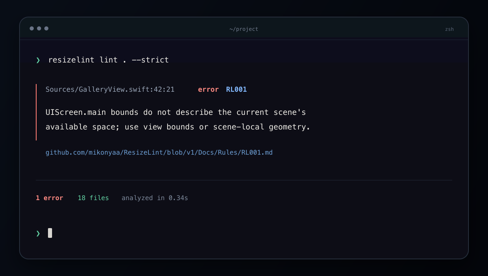

<p align="center">
  
</p>

<h1 align="center">ResizeLint</h1>

<p align="center"><strong>Catch the UIKit assumptions that break resizable iPhone apps.</strong></p>

ResizeLint is the deterministic verification layer for Swift apps that need to work in every window size.

## Installation

Homebrew installation is available with the 1.0 release:

```bash
brew install mikonyaa/tap/resizelint
resizelint version
```

Build the current source checkout with Swift 6.3.3:

```bash
git clone https://github.com/mikonyaa/ResizeLint.git
cd ResizeLint
swift build -c release
.build/release/resizelint version
```

ResizeLint supports macOS 14 or newer and Ubuntu 22.04 or newer on x86_64.

## 20-second terminal demo

```console
$ resizelint lint . --format xcode --strict
Sources/GalleryView.swift:42:21: error: [RL001] UIScreen.main bounds do not describe the current scene's available space; use view bounds or scene-local geometry.
Sources/GridViewController.swift:18:17: warning: [RL006] Choose layout from size classes or the actual container size, not the device idiom.
```



## Why resizing matters

A phone interface can now appear in window configurations that do not match the physical display. Screen-wide bounds, device idiom, interface orientation, and globally selected windows are therefore unreliable layout inputs. ResizeLint checks these assumptions with stable diagnostics that can run locally, in Xcode, or in CI.

ResizeLint does not rewrite app architecture and does not upload source. It can verify manual modernization work or changes produced by automated modernization tools.

## Rules

- **RL001 · error · main-screen-bounds** — flags `UIScreen.main` bounds used as local layout geometry.
- **RL002 · warning · main-screen-scale** — prefers trait or scene-local display scale.
- **RL003 · warning · main-screen-reference** — catches remaining `UIScreen.main` dependencies.
- **RL004 · error · global-window-access** — rejects arbitrary global current-window selection.
- **RL005 · error · global-status-bar-geometry** — replaces process-global status-bar geometry with scene-local context.
- **RL006 · warning · idiom-layout-decision** — finds phone/pad checks that drive layout.
- **RL007 · warning · orientation-layout-decision** — finds orientation checks that drive layout.
- **RL008 · error · legacy-app-lifecycle** — reports a proven app-level absence of scene lifecycle.
- **RL009 · info · fullscreen-requirement-review** — requests a deliberate review of full-screen requirements.

See [the complete rule documentation](Docs/Rules/README.md) for detection boundaries and adaptive examples. The release candidate reached 100% error and warning precision on the documented [external validation corpus](Docs/ExternalCorpus.md).

## GitHub Action

The Action becomes available with the 1.0 release and supports macOS arm64, macOS x86_64, and Linux x86_64:

```yaml
- id: resizelint
  uses: mikonyaa/ResizeLint@v1
  with:
    path: .
    config: .resizelint.yml
    fail-on: error
```

It downloads an exact release binary, verifies its SHA-256 checksum, writes SARIF, and exposes the report as `steps.resizelint.outputs.sarif`. The Action itself needs only `contents: read`; SARIF upload is a separate optional step with separate permissions. See [GitHub Action integration](Docs/GitHubAction.md).

## Configuration

Create a strict starter file:

```bash
resizelint init
```

```yaml
version: 1
include:
  - "**/*.swift"
  - "**/Info.plist"
  - "**/*.xcodeproj/project.pbxproj"
exclude:
  - ".build/**"
  - "Pods/**"
baseline: ".resizelint-baseline.json"
fail_on: error
rules:
  RL002:
    severity: warning
overrides:
  - files:
      - "Sources/Game/**"
    rules:
      RL009:
        enabled: false
```

Unknown keys and unknown rule IDs are errors. See [configuration reference](Docs/Configuration.md).

## Baseline

Adopt ResizeLint without accepting new debt:

```bash
resizelint baseline create .
resizelint lint .
resizelint baseline check .
resizelint baseline update .
```

Baselines contain stable fingerprints rather than line-only positions. New findings continue to fail CI. See [baseline behavior](Docs/Baselines.md).

## Safe fixes

`lint` never changes files. `fix` only applies a context-proven RL002 replacement where `traitCollection.displayScale` is directly available.

```bash
resizelint fix Sources --dry-run
resizelint fix Sources
```

Edits are checked for overlap, reparsed, written atomically, and verified by a second analysis pass. Permissions and line endings are preserved.

## ResizeLab

`Examples/ResizeLab` pairs legacy and adaptive implementations of the same gallery. It demonstrates screen-bound sizing, device-idiom grids, orientation branching, global window lookup, and scene-aware alternatives.

```bash
cd Examples/ResizeLab
xcodegen generate
open ResizeLab.xcodeproj
```

Run ResizeLab only in an iOS Simulator. Exercise compact, square, and wide windows, Dynamic Type, light and dark appearance, Reduce Motion, and Reduce Transparency.

## Limitations

- Storyboard and XIB geometry are not analyzed.
- Broad SwiftUI fixed-frame heuristics are intentionally excluded from 1.0.
- Ambiguous target-to-plist relationships do not produce RL008 errors.
- The only automatic fix is the proven-safe RL002 instance-member case.
- Windows and Linux arm64 binaries are not part of 1.0.
- ResizeLint is static analysis; it does not perform runtime resize automation.

## Roadmap

Candidates for 1.1 include richer Xcode target mapping, `resizelint explain RL001`, Linux arm64, an incremental cache, and a local HTML report. Proposals must preserve deterministic output and high precision.

## Contributing, security, and license

Read [CONTRIBUTING.md](CONTRIBUTING.md) before changing a rule. False-positive changes need a minimized regression fixture and corpus evidence. Report sensitive problems through the process in [SECURITY.md](SECURITY.md). Community expectations are in [CODE_OF_CONDUCT.md](CODE_OF_CONDUCT.md).

ResizeLint is available under the [MIT License](LICENSE).

ResizeLint is an independent open-source project and is not affiliated with or endorsed by Apple Inc.
